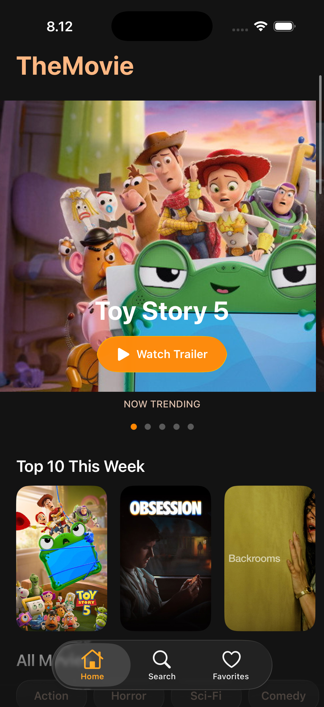
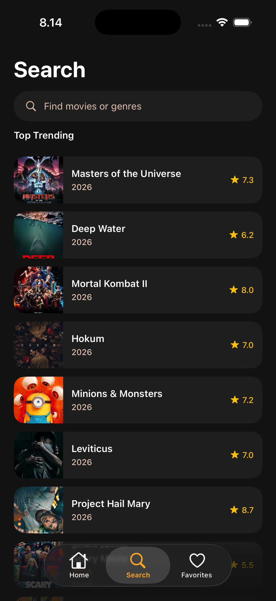
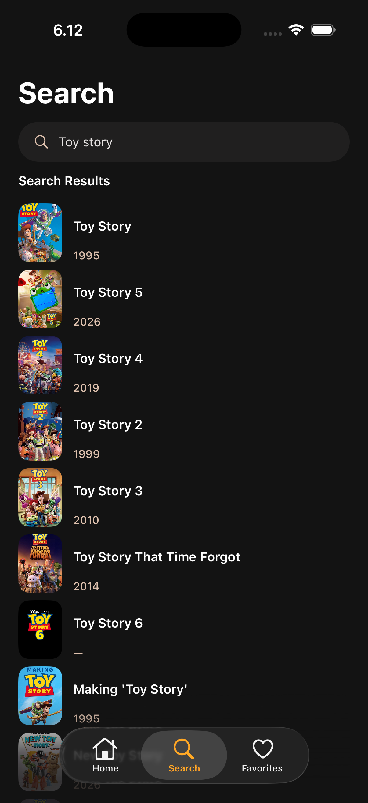
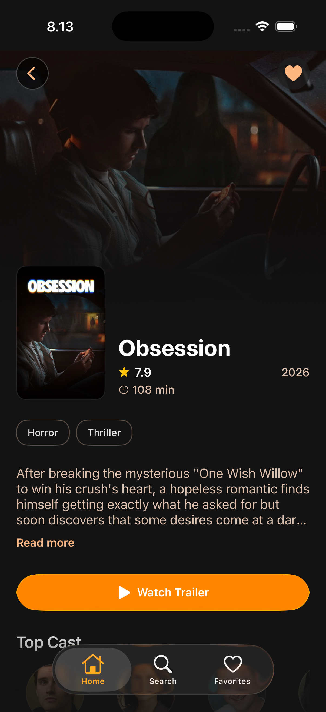
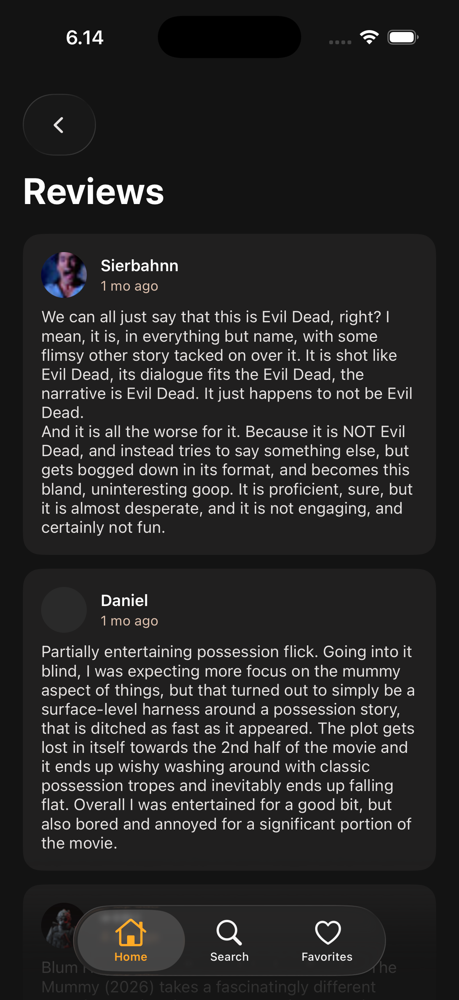
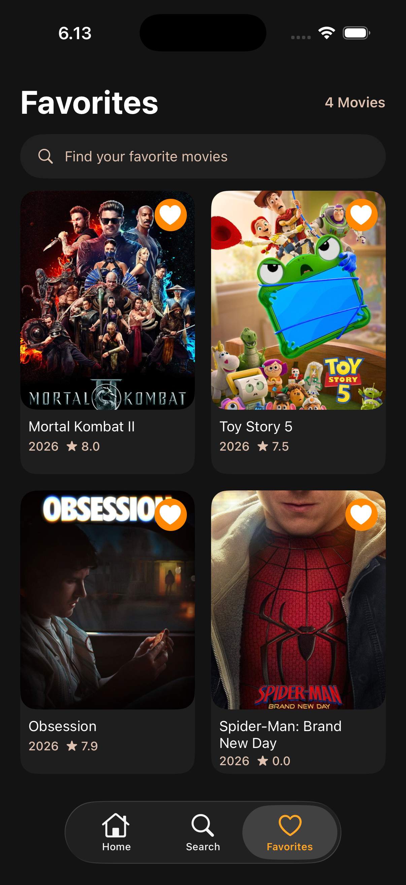

# TheMovie

A cinematic iOS movie discovery app built with **UIKit**, **SwiftUI**, and **VIPER**. Browse trending films, search TMDB, save favorites, and explore movie details with cast and user reviews.

<p align="center">
  
  
  
  
  
  
</p>

---

## Features

- **Home** — Auto-sliding hero carousel, Top 10 This Week, genre-filtered movie grid with infinite scroll
- **Search** — Trending movies and live TMDB search
- **Favorites** — Persisted favorites with local search
- **Movie Detail** — Backdrop, overview, trailer, cast, and review previews
- **Reviews** — Full paginated user reviews (SwiftUI)
- **Design** — Cinematic Noir dark theme with iOS 26 Liquid Glass controls

---

## Requirements

| Tool      | Version              |
| --------- | -------------------- |
| macOS     | Latest recommended   |
| Xcode     | 26+ (iOS 26 SDK)     |
| CocoaPods | 1.12+                |
| Ruby      | 2.7+ (for CocoaPods) |

You also need a free **[TMDB API](https://www.themoviedb.org/settings/api)** read access token (Bearer token).

---

## Setup

### 1. Clone the repository

```bash
git clone https://github.com/fatih-fwzzz/TheMovieApp.git
cd TheMovie
```

### 2. Configure your TMDB token

**Option A — `.env` file (recommended)**

```bash
cp .env.example .env
```

Open `.env` and paste your TMDB v4 read access token:

```env
TMDB_BEARER_TOKEN=eyJhbGciOiJIUzI1NiJ9...
```

Get a token at [themoviedb.org/settings/api](https://www.themoviedb.org/settings/api) → **API Read Access Token**.

**Option B — `Config.xcconfig` manually**

```bash
cp Config.xcconfig.example Config.xcconfig
```

Edit `Config.xcconfig` and set `TMDB_BEARER_TOKEN`.

> **Do not commit** `.env` or `Config.xcconfig` — both are gitignored.

### 3. Install dependencies

```bash
pod install
```

Running `pod install` automatically syncs your TMDB token from `.env` into `Config.xcconfig`.

### 4. Open the workspace

```bash
open TheMovie.xcworkspace
```

> Always open **`TheMovie.xcworkspace`**, not `TheMovie.xcodeproj`.

### 5. Run the app

1. Select an **iPhone** simulator (iOS 26+)
2. Choose the **TheMovie** scheme
3. Press **⌘R**

If the token is missing or invalid, API calls will fail. Double-check `.env` and run `pod install` again.

---

## Running tests

```bash
xcodebuild \
  -workspace TheMovie.xcworkspace \
  -scheme TheMovie \
  -destination 'platform=iOS Simulator,name=iPhone 17' \
  test
```

Or in Xcode: **⌘U**

---

## Project structure

```
TheMovie/
├── TheMovie/                  # Main app target
│   ├── App/                   # AppDelegate, DI, navigation, tab bar
│   ├── Core/
│   │   ├── Network/           # TMDB client, models, favorites store
│   │   └── UI/                # Design tokens & shared components
│   └── Features/
│       ├── Home/
│       ├── Search/
│       ├── Favorites/
│       ├── Detail/
│       └── Reviews/
├── TheMovieTests/             # Unit tests
├── docs/screenshots/          # App screenshots for README
├── Podfile                    # Third-party dependencies
├── .env.example               # TMDB token template
└── Config.xcconfig.example    # Alternate token config template
```

---

## Architecture

The app follows **VIPER** (View · Interactor · Presenter · Entity · Router) per feature. See [`VIPER-Components.md`](VIPER-Components.md) for the full module map.

```
Tab Bar (Home | Search | Favorites)
  └── Movie Detail (UIKit)
        └── Reviews (SwiftUI)
```

Cross-feature navigation is handled by `AppNavigation` in the app layer — feature modules stay decoupled.

---

## Tech stack

| Layer       | Libraries                                                                                                               |
| ----------- | ----------------------------------------------------------------------------------------------------------------------- |
| Networking  | [Alamofire](https://github.com/Alamofire/Alamofire) · [URLSession](TheMovie/Core/Network/AlamofireNetworkService.swift) |
| Images      | [Kingfisher](https://github.com/onevcat/Kingfisher)                                                                     |
| Loading UI  | [SkeletonView](https://github.com/Juanpe/SkeletonView)                                                                  |
| Transitions | [Hero](https://github.com/HeroTransitions/Hero)                                                                         |
| API         | [The Movie Database (TMDB)](https://www.themoviedb.org/documentation/api)                                               |

---

## Troubleshooting

| Problem                   | Fix                                                              |
| ------------------------- | ---------------------------------------------------------------- |
| `pod: command not found`  | Install CocoaPods: `sudo gem install cocoapods`                  |
| Build fails after clone   | Run `pod install`, open `.xcworkspace`                           |
| Movies don't load         | Verify TMDB token in `.env`, then `pod install`                  |
| Token still not picked up | Clean build folder (**⇧⌘K**) and rebuild                         |
| Sandbox script error      | Already handled in Podfile `post_install` — re-run `pod install` |

---